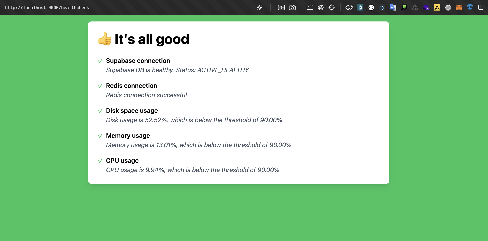

# allgood

Quickly set up a health check page for your Golang app 



## Installation
```commandline
go get github.com/saintmalik/allgood
```

## Usage

```go

import (
	"github.com/saintmalik/allgood"
)

func main() {

	redisClient, err := initializeRedis(redisurl)
	if err != nil {
		fmt.Println("Redis initialization failed")
	}


	ref := "<your-supabase-project-ref>"
	apiKey := "<your-supabase-api-key>"

	// Create an allgood engine and configure with the checks you want
	engine := allgood.NewEngine(
		allgood.WithCheckDiskSpace(90),
		allgood.WithCheckMemoryUsage(90),
		allgood.WithCheckCPUUsage(90),
		allgood.WithCheckSupabaseConnection(ref,apiKey),
		allgood.WithCheckRedisConnection(redisClient,allgood.WithCheckName("My Redis Conn"))
	)


	http.HandleFunc("/healthcheck", engine.HealthCheckHandler())
	http.ListenAndServe(":8080", nil)
}
```